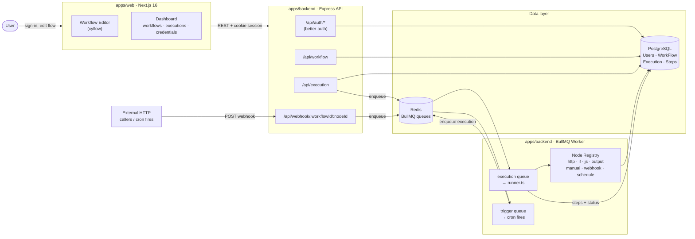

# Kaith

A self-hostable workflow automation platform. Build workflows visually, trigger them via webhook / schedule / manual run, and execute them asynchronously on a worker pool.

## Architecture



## Repository layout

```
apps/
  web/       Next.js 16 dashboard + visual editor (xyflow, tailwind, zustand)
  backend/   Express API server + BullMQ worker + Prisma schema
packages/
  ui/                  shared React components
  eslint-config/       shared ESLint config
  typescript-config/   shared tsconfig bases
```

### `apps/backend`

Two entrypoints share the same codebase:

- `src/index.ts` — HTTP API. Mounts `better-auth` at `/api/auth/*` and the app router at `/api`.
- `src/worker.ts` — BullMQ worker. Consumes the execution queue (runs workflows via `engine/runner.ts`) and the trigger queue (cron fires → enqueues executions).

Key directories:

- `src/engine/` — workflow runner, node registry, template interpolation (`$input`, `$trigger`, `$nodes`).
- `src/apps/` — built-in node handlers registered against the engine:
  - triggers: `manual`, `webhook`, `schedule` (cron)
  - actions: `http`, `if` (branch), `js` (sandboxed JS), `output`
- `src/router/` — Express routers for `workflow`, `execution`, `webhook`, `test`.
- `prisma/schema.prisma` — `Users`, `Sessions`, `Accounts`, `Verifications`, `WorkFlow`, `Execution`, `Steps`.

### `apps/web`

- `app/(auth)/` — sign-in / sign-up flows (better-auth client).
- `app/(dashboard)/` — `workflows`, `executions`, `credentials`, `overview`, `settings`.
- `components/workflow/` — xyflow editor, node palette, per-node config panels.

## Execution model

1. A trigger fires (manual run, incoming webhook, or scheduled cron job).
2. The API creates an `Execution` row with a snapshot of the workflow's nodes + edges and enqueues a job on the BullMQ `execution` queue.
3. The worker claims the execution with `SELECT … FOR UPDATE SKIP LOCKED`, then walks the graph BFS from the trigger node.
4. Each node's handler receives `(input, config, ctx)` where `ctx` exposes `$input`, `$trigger`, and `$nodes` (outputs of previously-run parents, keyed by label). Config values are interpolated against that context.
5. A `Steps` row is written per node with input, output, and status — this is what the Executions UI reads back.

## Prerequisites

- Node.js `>= 18`
- pnpm `9`
- PostgreSQL
- Redis (for BullMQ)

## Getting started

```sh
pnpm install

# apps/backend/.env — set DATABASE_URL, REDIS_URL, auth secrets, PORT, etc.
# See apps/backend/src/env.ts for the full list.

pnpm --filter backend prisma:migrate
pnpm --filter backend prisma:generate
```

Run everything in dev:

```sh
pnpm dev                              # turbo: web + backend api
pnpm --filter backend dev:worker      # BullMQ worker (separate process)
```

Individual apps:

```sh
pnpm --filter web dev                 # Next.js on :3000
pnpm --filter backend dev             # Express API
```

## Scripts

From the repo root (Turborepo fans these out):

```sh
pnpm build         # build all apps/packages
pnpm dev           # dev all (web + backend api)
pnpm lint          # lint all
pnpm check-types   # tsc --noEmit across the workspace
pnpm format        # prettier
```
